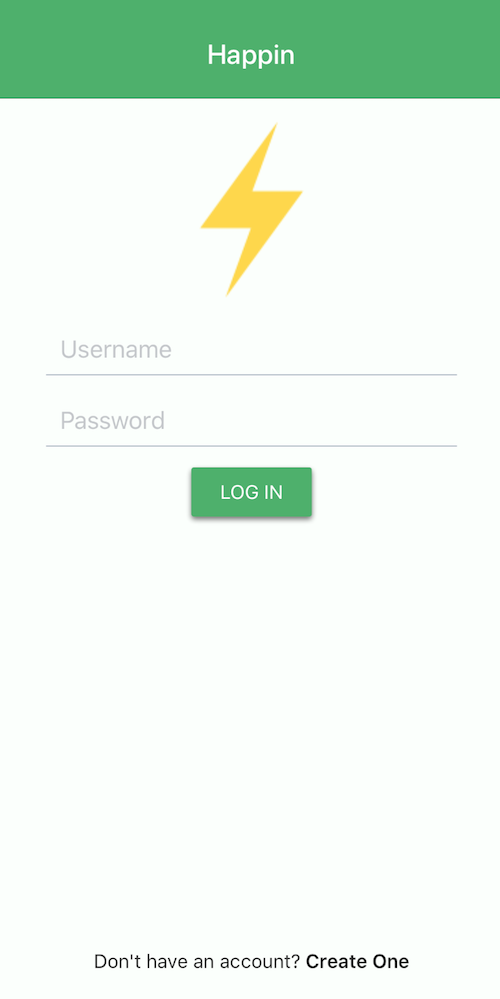
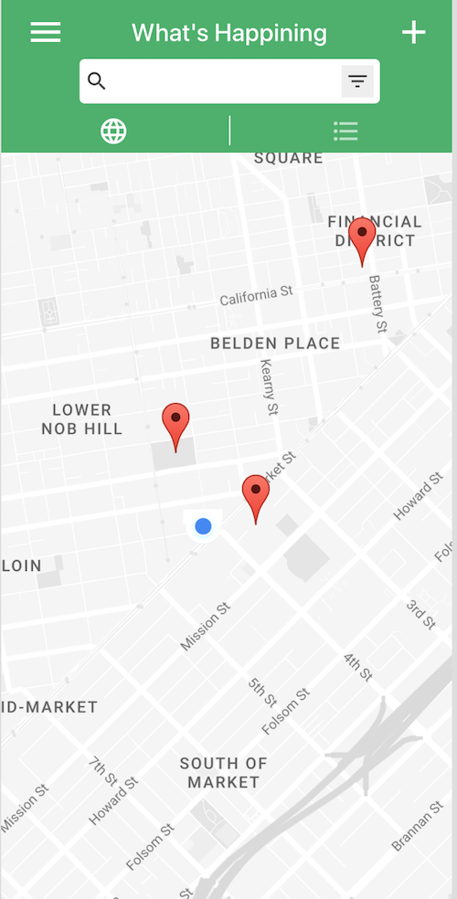
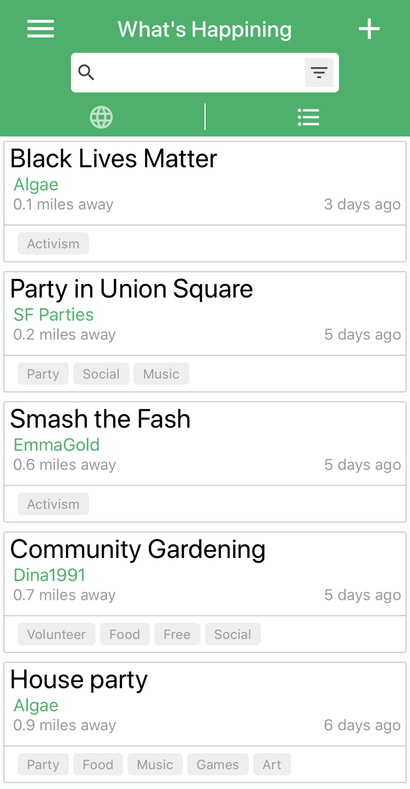

# Happin
### The mobile app for the modern community
An cross-platform mobile app to help people organize effectively in their local communities. The main feature is a live updating map with a Waze-esque method of alerting the user to points of interest and hazards in real-time. This will allow organizers to communicate the location of a police blockade to everyone at a rally within seconds, for street medics to keep participants updated with the location of first aid stations, or to help people navigate to the water fountains and public bathrooms at large events. We are open to feedback from community organizers, developers, and anyone else!

## Built With
This project was bootstrapped with [Create React Native App](https://github.com/react-community/create-react-native-app). Documentation for Create React Native App is available [here](https://github.com/react-community/create-react-native-app/blob/master/react-native-scripts/template/README.md).

## Development
For development, you can run the app on your phone using the Expo app or on your computer using an Android or iOS simulator. First, clone the repo and run:
```
npm install
npm start
```
You should see a QR code in your terminal. To run the app on your phone, download the Expo app and scan the QR code. Make sure you are connected to the same network on your phone and the computer running the app. Any changes you make in the code will be reflected in the expo app. If you want to run the app on your computer, type `a` to run an Android simulator or `i` to run iOS. To do so, you must have Android Studio or XCode, respectively.

## TODO
- User should be able to drop a pin on the map
- Comment & document & refactor
- Event privacy settings
- Roles: Users can join an event as an organizer, flag holder or participant
- Forum/notifications
- Eject to Android Studio & ship to Google Play store

## Images



